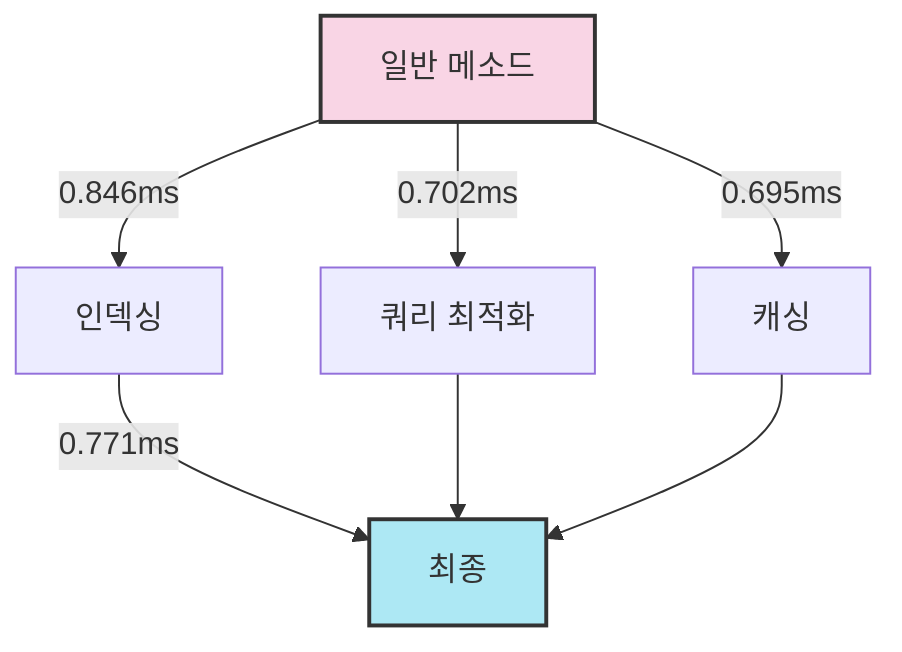

# SPRING PLUS
# Skill
Jenkins Docker Spring actuator
health-check api : http://13.124.17.212:8081/health

# EC2

# VPC

# RDS 

# S3

# Manager Log
주요 기능 설명:
1. 스케줄링:
   * @Scheduled(cron = "0 0 0/6 * * *"): 매 6시간마다 이 메서드가 자동으로 실행됩니다.
2. 로그 조회:
   * cutoffDate로부터 1시간 이전의 로그들을 조회하여, 데이터베이스에서 해당 로그들을 가져옵니다.
   * 조회된 로그의 개수와 각 로그의 내용을 출력하여 확인할 수 있습니다.
3. 로그 파일 저장:
   * 로그가 저장될 파일의 경로는 logExportPath와 현재 날짜를 기반으로 생성됩니다.
   * 해당 디렉토리가 존재하지 않으면 새로 생성하며, 이미 존재하는 파일이 있을 경우 파일의 내용을 덧붙이는 방식(FileWriter의 append 모드)으로 로그를 기록합니다.
   * 각 로그는 formatLog(log) 메서드를 통해 포맷팅된 후 파일에 저장됩니다.
4. 로그 삭제:
   * 로그가 파일로 저장된 후, 지정된 cutoffDate 이전의 로그들을 데이터베이스에서 삭제합니다.
5. 예외 처리:
   * 파일 쓰기나 디렉토리 생성 과정에서 발생할 수 있는 IOException에 대해 예외 처리가 되어 있으며, 오류가 발생하면 콘솔에 에러 메시지와 스택 트레이스가 출력됩니다.
코드 흐름 요약:
1. 데이터베이스에서 1시간 이전의 로그 조회.
2. 로그 개수와 내용을 콘솔에 출력.
3. 로그를 텍스트 파일로 저장.
4. 로그를 데이터베이스에서 삭제.

데이터베이스 부하를 줄이기 위해 주기적으로 로그를 외부 파일로 내보내고, 오래된 로그를 제거하여 데이터베이스 공간을 효율적으로 관리합니다.

# 사용자 검색 성능 최적화 결과

아래는 사용자 검색 기능에 적용된 다양한 최적화 기법의 평균 실행 시간 비교입니다.

| 최적화 기법 | 평균 실행 시간 (ms) | 개선율 (%) |
|------------|-------------------|------------|
| 일반 메소드 (기준) | 0.846 | - |
| 인덱싱 | 0.702 | 17.02% |
| 쿼리 최적화 | 0.695 | 17.85% |
| 캐싱 | 0.771 | 8.87% |

## 시각화

## 분석

1. 일반 메소드(기준)의 평균 실행 시간은 0.846 ms였습니다.
2. 인덱싱을 통해 성능이 17.02% 개선되어 실행 시간이 0.702 ms로 줄었습니다.
3. 쿼리 최적화는 더 나은 성능 향상을 보여, 기준 대비 17.85% 개선된 0.695 ms의 실행 시간을 달성했습니다.
4. 예상 외로, 캐싱은 다른 기법들보다 적은 개선을 보였으며, 기준 대비 8.87% 개선에 그쳤습니다. 이는 특정 쿼리의 특성이나 캐싱 구현 방식 때문일 수 있습니다.

## 결론

쿼리 최적화가 가장 좋은 성능 개선을 보였으며, 인덱싱이 그 뒤를 이었습니다. 캐싱도 일부 개선을 제공했지만, 이 특정 사례에서는 다른 기법들만큼 효과적이지 않았습니다. 캐싱 전략에 대한 추가 조사를 통해 예상만큼 큰 개선을 보이지 않은 이유를 파악해볼 필요가 있습니다.
