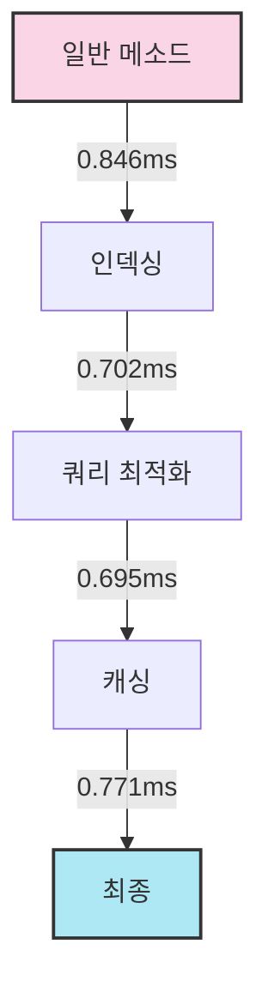

# SPRING PLUS

# 사용자 검색 성능 최적화 결과

아래는 사용자 검색 기능에 적용된 다양한 최적화 기법의 평균 실행 시간 비교입니다.

| 최적화 기법 | 평균 실행 시간 (ms) | 개선율 (%) |
|------------|-------------------|------------|
| 일반 메소드 (기준) | 0.846 | - |
| 인덱싱 | 0.702 | 17.02% |
| 쿼리 최적화 | 0.695 | 17.85% |
| 캐싱 | 0.771 | 8.87% |

## 시각화

## 분석

1. 일반 메소드(기준)의 평균 실행 시간은 0.846 ms였습니다.
2. 인덱싱을 통해 성능이 17.02% 개선되어 실행 시간이 0.702 ms로 줄었습니다.
3. 쿼리 최적화는 더 나은 성능 향상을 보여, 기준 대비 17.85% 개선된 0.695 ms의 실행 시간을 달성했습니다.
4. 예상 외로, 캐싱은 다른 기법들보다 적은 개선을 보였으며, 기준 대비 8.87% 개선에 그쳤습니다. 이는 특정 쿼리의 특성이나 캐싱 구현 방식 때문일 수 있습니다.

## 결론

쿼리 최적화가 가장 좋은 성능 개선을 보였으며, 인덱싱이 그 뒤를 이었습니다. 캐싱도 일부 개선을 제공했지만, 이 특정 사례에서는 다른 기법들만큼 효과적이지 않았습니다. 캐싱 전략에 대한 추가 조사를 통해 예상만큼 큰 개선을 보이지 않은 이유를 파악해볼 필요가 있습니다.
